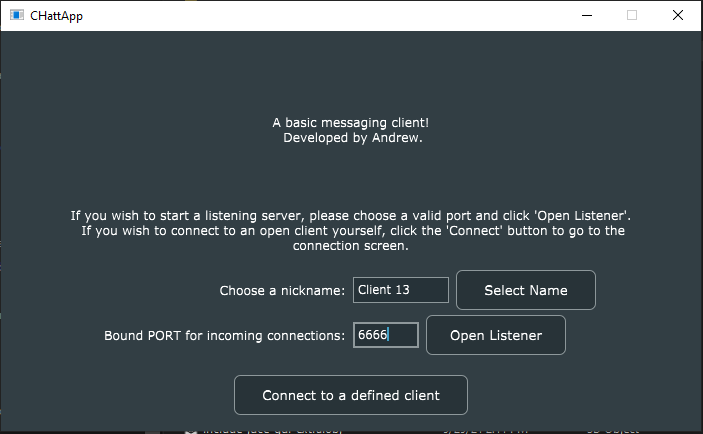
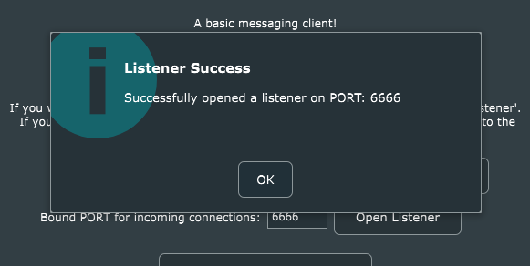
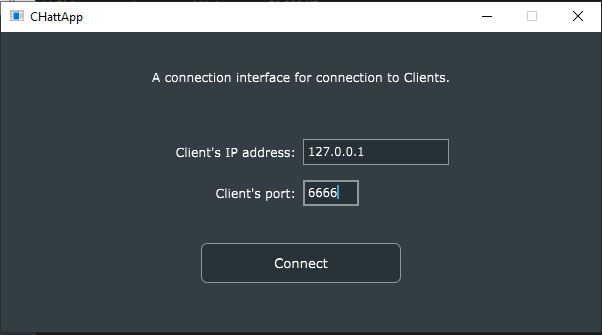
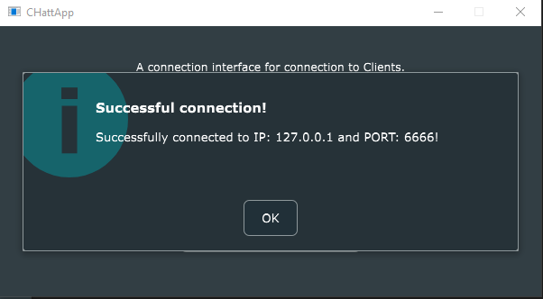
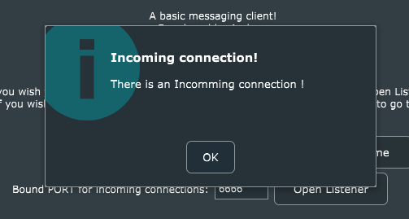
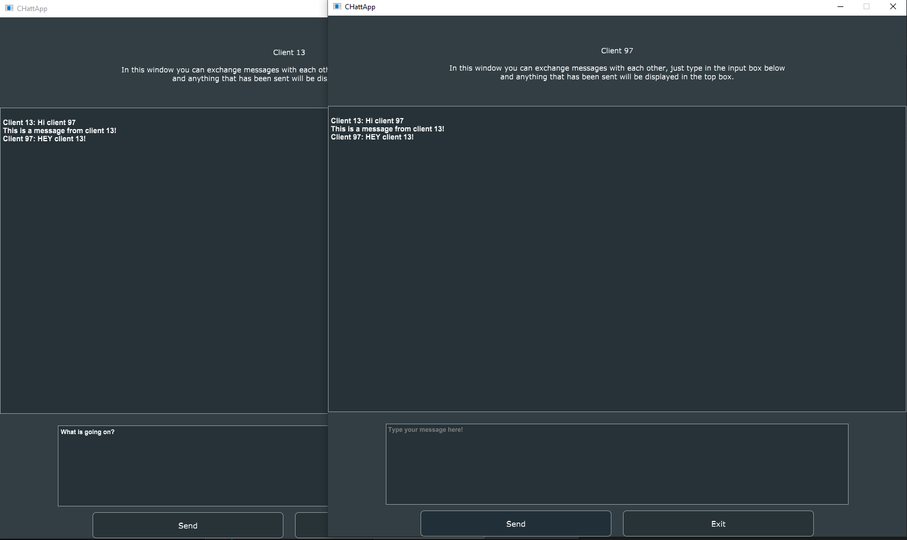

# Basic chat Application
This basic client side chat application can be used over the network (for now only over the local network).

This app works such that two clients can run it, connect to each other by supplying the correct IP addresses and ports and then sending unicode messages between one another.

It is possible to connect these clients over the global network by using programs such as Hamachi that simulate a local network connection over the public network.

## The Interface and usage

    

This first client will be designated as a listener. 
Both clients will be run on a single PC, this is why the IP address is implicitly 127.0.0.1. The port is chosen to be 6666 but can be anything between 1 and 65535.
After setting this information, the listener is opened by clicking the button "Open listener".

    

A window appears to inform the user about a success.

    

The second client will be designated as the one that will be connecting to the first one, so the correct IP address of the first client must be set, and the same port.
After this we click on the "Connect to a definec client" button.

    

A window appears to inform the user about a success.

    

And on the first client, at the same time, this window appears.

    

After initiating the connection, clients can send messages to each other.

## Planned updates
- Enabling this app to function over the public network, however, this would require at least a server handshake to initialize the connection between clients.

*© Copyright Andrew Coachman 2021, all rights included*